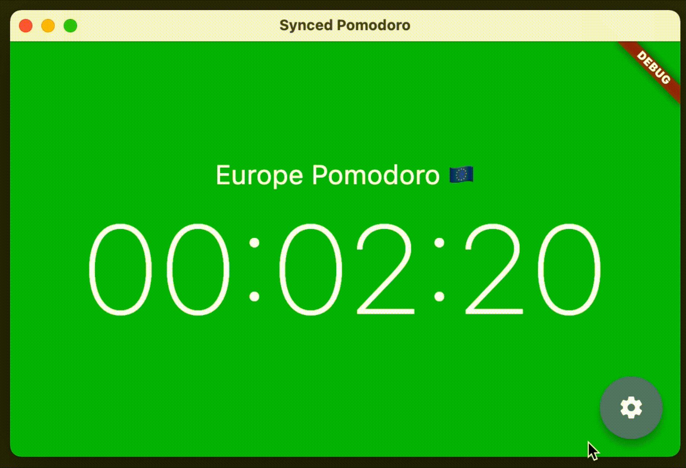

# synced_pomodoro

Synced Pomodoro client app. Pomodoro definitions are defined on a remote server and users can connect to any of them by setting the pomodoro id in the app settings>



## Getting Started

```
flutter pub get
flutter config --enable-macos-desktop
flutter run -d macos
```
